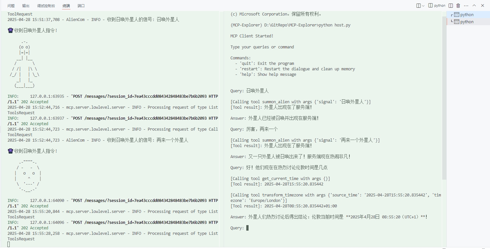

# MCP-Explorer

本项目意在学习创建一个MCP客户端，要实现的内容包括

- 通过API调用远端大模型
- 本地部署大模型
- 建立MCP客户端
- 创建一些本地MCP服务器供使用

## 依赖环境

使用`pip install -r requirements.txt`或者`uv add -r requirements.txt`安装所需环境

## 结构说明

- host.py: 自己搭建的MCP host，里面实际上是一个Client负责接入本地（将来或许支持远端）的Server。其配置文件为config.py，模型与一些功能选择需要通过修改config.py来进行。

- LLM_examples: 各个模型的调用方法。
  - Gemini: Google Gemini系列模型。
  - OpenAI: 兼容OpenAI API 格式的模型，目前包括Deepseek和Qwen系列。
  - Ollama: Ollama上可用的模型。

- my_servers: 自己写的MCP Server脚本。
  - Timetools: 提供时间查询和时区转换功能。
  - Unsplash: 提供壁纸查询、壁纸下载和设置壁纸功能。
  - BraveSearch: 提供网络搜索功能。
  - AlienCom: 在服务器上召唤一个外星人。这是一个通过SSE方式连接MCP Server的示例。
  - CatCom: 在服务器上召唤一个小猫。这是一个通过streamable http方式连接MCP Server的示例。

- client_examples: 自己写的MCP Client示例脚本。
  - stdio_client: 以stdio为连接方式，只能搭配本地的服务脚本使用。命令行执行`python client.py <path to server script>`即可将其连接到本地脚本。比如，将my_servers/Timetools.py中的运行方式设为`run_server(mode='stdio')`，然后执行`python client.py my_servers/Timetools.py`即可。
  - sse_client: 以sse为连接方式，通过指定的端口连接到已经启动的服务。想要试用的话，将my_servers/Timetools中的运行方式由`run_server(mode='stdio')`改成`run_server(mode='sse', port=8000)`并运行，再执行`uv run sse_client.py http://localhost:8000/sse`即可。或者以my_servers/AlienCom.py为例，先运行my_servers/AlienCom.py（默认端口号8080），再执行`uv run sse_client.py http://localhost:8080/sse`即可。
  - streamable-http_client.py: 以streamable http为连接方式，通过指定的端口连接到已经启动的服务。以my_servers/CatCom.py为例，先运行my_servers/CatCom.py，再运行client_examples\streamable-http_client.py即可。server与client中默认的端口号需保持一致，默认8081。

## 使用方法

在项目目录下创建.env文件，在其中设置API

```txt
UNSPLASH_API="xxx"
BRAVE_API_KEY="xxx"

GEMINI_API_KEY="xxx"
DASHSCOPE_API_KEY="xxx" 
DEEPSEEK_API_KEY="xxx"
HUNYUAN_API_KEY="xxx"
OLLAMA_API_KEY="ollama"
```

Unsplash是获取壁纸的工具，申请Unsplash的API key参见[这里](https://unsplash.com/documentation#getting-started)。

Brave search是一个搜索工具，申请API点击[这里](https://brave.com/search/api/)。

Ollama用于本地部署大模型，并不需要API key，但为了符合OpenAI调用规则还是需要"ollama"作为key字符串。

## 效果

以下是调用deepseek-chat分别调用AlienCom（sse类型的server）和Timetools（stdio类型的server）工具的截图：



它也太捧场了XD
